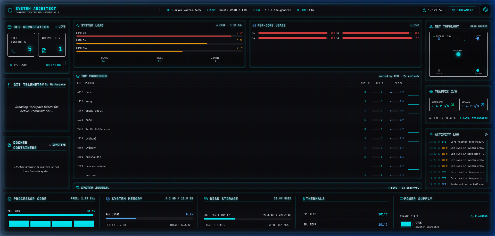

# System Architect — Cyberpunk Live Wallpaper

> A production-grade Linux desktop live wallpaper that renders your system telemetry as a real-time command center HUD.



---

## Overview

System Architect replaces your static wallpaper with a fully animated, data-driven dashboard. A lightweight **FastAPI backend** reads kernel interfaces (`/proc`, `/sys`, Docker socket, git) every second and streams telemetry over **WebSocket** to a **React/Vite frontend** rendered by **PyWebView** (GTK/WebKit2). The window is set to the `DESKTOP` WM type — it sits below every application window, behaves like a real wallpaper, and survives workspace switches.

---

## Screenshots

### Full Dashboard


### Panel Breakdown

| Panel | Contents |
|---|---|
| **Header** | Hostname, distro, kernel, uptime, live clock, streaming indicator |
| **Left** | Dev Workstation (shells + IDEs), Git Telemetry, Docker Containers |
| **Center** | System Load averages, Per-Core bars, Top Processes table, System Journal |
| **Right** | Network Mesh Topology, Traffic I/O speeds, Activity Log |
| **Bottom** | CPU core graph, RAM, Disk I/O, Thermals, Battery / Power Supply |

---

## Features

### Real-Time Telemetry
- **CPU** — total load %, per-core bars, frequency, 1m/5m/15m load averages
- **Memory** — used/free/total, live sparklines
- **Disk** — root partition usage, read/write throughput
- **Network** — per-interface download/upload rates, animated mesh topology
- **Thermals** — CPU + GPU temperatures with warning/critical color thresholds
- **Battery** — charge %, charging state, adapter detection

### Developer Workspace
- Detects running **VS Code**, **Cursor**, and **JetBrains** IDEs via `/proc`
- Scans open **terminal** instances
- Reads **Git** repo status (branch, modified files, commits today, dirty state)
- Polls **Docker** socket for running/total container counts

### Process Monitor
- Sorted process table with PID, name, CPU%, MEM%, and inline sparklines
- Refreshes every 2 seconds from telemetry data

### System Journal
- Rolling live log stream (INFO / WARN / ERR) from systemd, kernel, thermal, and network sources

### Theming & Settings
- 4 color themes: **Cyber Cyan**, **Toxic Emerald**, **Deep Violet**, **Retro Amber**
- Toggle individual panels (Git, Docker, Network)
- Animation quality modes: **High / Low** (CRT scanlines, scan laser)

---

## Architecture

```
┌─────────────────────────────────────────────────────────────────┐
│                        Linux Kernel                             │
│  /proc/stat  /proc/meminfo  /sys/class/hwmon  /proc/net/dev    │
│  docker.sock  git CLI  /proc/<pid>/cmdline                      │
└──────────────────┬──────────────────────────────────────────────┘
                   │  direct filesystem reads (no subprocesses)
                   ▼
┌─────────────────────────────────────────────────────────────────┐
│             Backend — Python 3.10 / FastAPI / Uvicorn           │
│                                                                 │
│  collectors/                                                    │
│    system.py   → CPU, Memory, Disk, Network, Temperature        │
│    developer.py → Git, Docker, IDEs, Terminals                  │
│                                                                 │
│  services/telemetry_service.py  (1s polling loop)               │
│  app/main.py   GET /health  WS /ws/telemetry                    │
│                                                                 │
│  Serves compiled frontend static files from ../frontend/dist    │
└──────────────────┬──────────────────────────────────────────────┘
                   │  WebSocket (JSON, 1Hz)
                   ▼
┌─────────────────────────────────────────────────────────────────┐
│            Frontend — React 18 / Vite / TypeScript              │
│                                                                 │
│  hooks/useTelemetry.ts   WS client + reconnect + fallback sim   │
│  components/                                                    │
│    LeftPanel.tsx   Git · Docker · IDEs                          │
│    CenterPanel.tsx Load avg · Per-core · Processes · Journal    │
│    RightPanel.tsx  Net topology SVG · Traffic · Activity log    │
│    BottomPanel.tsx CPU · RAM · Disk · Thermals · Battery        │
│    SettingsPanel.tsx Themes · Toggles · Quality                 │
└──────────────────┬──────────────────────────────────────────────┘
                   │  loaded by
                   ▼
┌─────────────────────────────────────────────────────────────────┐
│           Desktop Wrapper — PyWebView / GTK / WebKit2           │
│                                                                 │
│  scripts/webview_wrapper.py                                     │
│    - Detects screen resolution via xrandr                       │
│    - Creates borderless fullscreen WebKit2 window               │
│    - Sets GTK hints: keep_below, skip_taskbar, sticky,          │
│      DESKTOP type, no-focus, click-through input region         │
│    - Watches xrandr for resolution changes and restarts         │
└─────────────────────────────────────────────────────────────────┘
```

---

## Requirements

| Dependency | Version | Purpose |
|---|---|---|
| Python | ≥ 3.10 | Backend runtime |
| Node.js | ≥ 18 | Frontend build toolchain |
| npm | ≥ 9 | Package management |
| GTK 3 + PyGObject | system | WebView window rendering |
| WebKit2GTK | system | HTML/CSS/JS rendering engine |
| python3-gi | system | GTK Python bindings |
| libcairo2-dev | system | Click-through input shape mask |

### Install system dependencies (Ubuntu / Debian)

```bash
sudo apt update
sudo apt install -y \
  python3-gi python3-gi-cairo \
  gir1.2-gtk-3.0 gir1.2-webkit2-4.1 \
  libcairo2-dev libgirepository1.0-dev \
  python3-venv python3-pip \
  nodejs npm
```

---

## Installation

### 1. Clone the repository

```bash
git clone https://github.com/yourname/system-architect.git
cd system-architect
```

### 2. Run the automated installer

```bash
chmod +x scripts/install.sh
./scripts/install.sh
```

The installer does the following:

1. Creates `backend/venv` with `--system-site-packages` (required for GTK access)
2. Installs Python dependencies from `backend/requirements.txt`
3. Installs Node packages and runs `npm run build` in `frontend/`
4. Templates `scripts/system-architect-wallpaper.service` with real paths → writes to `~/.config/systemd/user/`
5. Runs `systemctl --user enable --now system-architect-wallpaper.service`

> **Important:** The venv **must** be created with `--system-site-packages` so that `python3-gi` (PyGObject) and `cairo` from the system are accessible. If you see `ModuleNotFoundError: No module named 'gi'`, your venv was created without this flag. Rebuild it:
> ```bash
> rm -rf backend/venv
> python3 -m venv --system-site-packages backend/venv
> backend/venv/bin/pip install -r backend/requirements.txt
> ```

### 3. Set up desktop autostart

```bash
chmod +x scripts/setup_autostart.sh
./scripts/setup_autostart.sh
```

This creates `~/.config/autostart/system-architect-client.desktop` so the GUI wallpaper launches automatically on every GNOME login.

### 4. Launch the wallpaper

```bash
backend/venv/bin/python scripts/webview_wrapper.py
```

The wrapper automatically:
- Detects your screen resolution via `xrandr`
- Waits for the backend to respond on `:8000` before opening the window
- Sets GTK window hints to lock the window to the desktop layer

---

## Auto-Start on Login

After running both scripts, the full startup chain on login is:

```
Login
 ├── systemd --user starts system-architect-wallpaper.service
 │     └── uvicorn backend.app.main:app --host 127.0.0.1 --port 8000
 │           └── serves /ws/telemetry WebSocket + static frontend
 │
 └── GNOME autostart runs system-architect-client.desktop
       └── backend/venv/bin/python scripts/webview_wrapper.py
             └── waits for :8000, then opens GTK desktop window
```

No manual steps required after the first setup.

---

## Project Structure

```
system-architect/
├── backend/
│   ├── app/
│   │   ├── collectors/
│   │   │   ├── system.py       # CPU, memory, disk, network, thermals, battery
│   │   │   └── developer.py    # Git, Docker, IDEs, terminal count
│   │   ├── models/
│   │   │   └── telemetry.py    # Pydantic response schemas
│   │   ├── services/
│   │   │   └── telemetry_service.py  # 1s polling aggregation loop
│   │   ├── config.py           # Settings (poll interval, port, paths)
│   │   └── main.py             # FastAPI app, /health, /ws/telemetry
│   ├── requirements.txt
│   └── venv/                   # Created by install.sh (gitignored)
│
├── frontend/
│   ├── src/
│   │   ├── components/
│   │   │   ├── LeftPanel.tsx   # Dev workstation, Git, Docker
│   │   │   ├── CenterPanel.tsx # Load avg, per-core, processes, journal
│   │   │   ├── RightPanel.tsx  # Network topology, traffic, activity log
│   │   │   ├── BottomPanel.tsx # CPU, RAM, disk, thermals, battery
│   │   │   └── SettingsPanel.tsx # Theme, toggles, quality
│   │   ├── hooks/
│   │   │   └── useTelemetry.ts # WS client, reconnect, simulated fallback
│   │   ├── styles/
│   │   │   └── index.css       # Tailwind + CSS variables + scanline effects
│   │   ├── App.tsx             # Layout grid (left / center / right / bottom)
│   │   └── main.tsx
│   ├── dist/                   # Built by npm run build (gitignored)
│   ├── package.json
│   └── vite.config.ts
│
├── scripts/
│   ├── install.sh                         # One-shot installer
│   ├── setup_autostart.sh                 # Creates ~/.config/autostart entry
│   ├── webview_wrapper.py                 # PyWebView desktop window
│   └── system-architect-wallpaper.service # Systemd unit template (tokens)
│
├── shared/
│   └── types/
│       └── telemetry.d.ts      # Shared TypeScript interface definitions
│
└── docs/
    └── screenshot_ui.png
```

---

## Development

### Start the backend (with hot-reload)

```bash
backend/venv/bin/python -m uvicorn backend.app.main:app \
  --host 127.0.0.1 --port 8000 --reload
```

### Start the frontend dev server

```bash
cd frontend
npm run dev
# → http://localhost:5173
```

### Point the webview at the dev server

```bash
backend/venv/bin/python scripts/webview_wrapper.py --url http://localhost:5173
```

### Build production frontend

```bash
cd frontend && npm run build
# Output: frontend/dist/ — served automatically by FastAPI
```

---

## Service Management

```bash
# Check backend service status
systemctl --user status system-architect-wallpaper.service

# View live backend logs
journalctl --user -u system-architect-wallpaper.service -f

# Restart after code changes
systemctl --user restart system-architect-wallpaper.service

# Disable autostart
systemctl --user disable system-architect-wallpaper.service

# Remove desktop autostart entry
rm ~/.config/autostart/system-architect-client.desktop
```

---

## Troubleshooting

### `ModuleNotFoundError: No module named 'gi'`

The venv was created without system site packages. GTK bindings (`python3-gi`) live in `/usr/lib/python3/dist-packages/` and are not pip-installable.

```bash
rm -rf backend/venv
python3 -m venv --system-site-packages backend/venv
backend/venv/bin/pip install -r backend/requirements.txt
```

### Systemd service shows `bad-setting` / `inactive (dead)`

The service file still contains un-substituted template tokens (`{{WORKING_DIR}}`). Re-run the installer or substitute manually:

```bash
sed -e "s|{{WORKING_DIR}}|$(pwd)|g" \
    -e "s|{{PYTHON_PATH}}|$(pwd)/backend/venv/bin/python|g" \
    scripts/system-architect-wallpaper.service \
    > ~/.config/systemd/user/system-architect-wallpaper.service

systemctl --user daemon-reload
systemctl --user enable --now system-architect-wallpaper.service
```

### Window appears on top of other windows / is not on desktop layer

GTK window hints require a compositing window manager. Ensure GNOME Shell is running:

```bash
echo $XDG_CURRENT_DESKTOP   # should print GNOME
echo $XDG_SESSION_TYPE      # should print x11 or wayland
```

> **Note:** On Wayland, `_NET_WM_WINDOW_TYPE_DESKTOP` may behave differently depending on the compositor. X11 (Xorg session) is fully supported.

### Blank white window / WebKit rendering issue

Set the DMA-buf renderer workaround (already set in `webview_wrapper.py`):

```bash
WEBKIT_DISABLE_DMABUF_RENDERER=1 backend/venv/bin/python scripts/webview_wrapper.py
```

### Backend not responding at `:8000`

```bash
# Check if uvicorn is running
systemctl --user status system-architect-wallpaper.service

# Check what's on port 8000
ss -tlnp | grep 8000

# Test manually
curl http://127.0.0.1:8000/health
```

---

## Resource Footprint

| Component | CPU | Memory |
|---|---|---|
| Backend (uvicorn) | ~1–3% (1 core) | ~35–50 MB |
| Frontend (WebKit2) | ~3–8% | ~80–150 MB |
| **Total** | **~4–11%** | **~115–200 MB** |

Readings from a 4-core AMD Ryzen 5 3500U @ 2.4 GHz with 13.5 GB RAM.

---

## License

MIT — use freely, attribution appreciated.
